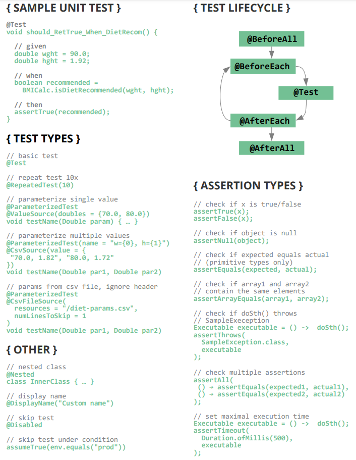
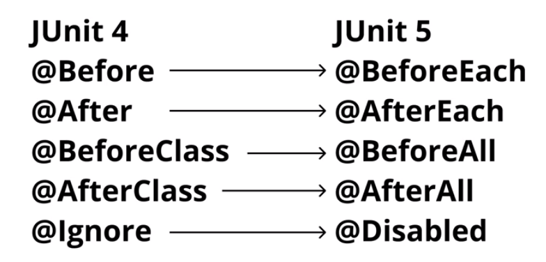
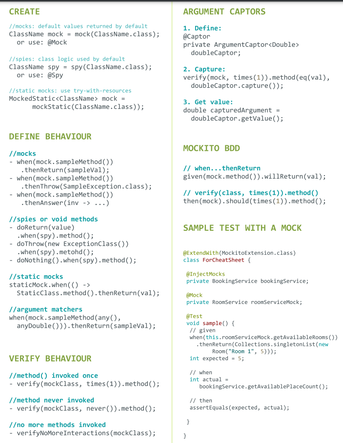

- ## New In JUnit 5
    - ### Annotations
        - @Nested
        - @RepeatedTest
    - ###  Test Types
        - 
- ## Difference between JUnit4 and JUnit5
    - 
- ## Mocking Frameworks

#####      1.  Mokito
        - Mock final method using mockito-inline
        - But private method can't be mock
        - No mocks for final or static methods, and for constructors, solution for this problem is using
            -  **Power Mock**
**Mockito class Diagram**

##### 2.  JMockit
##### 3.  EassyMock

## Mokito Cheat sheet

